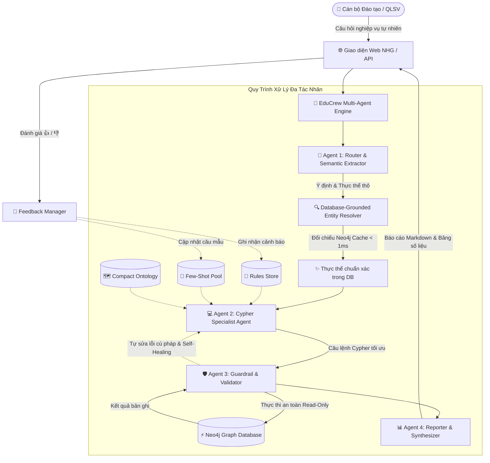

# 🎓 Edu-Graph Multi-Agent Assistant

> **Hệ thống Trợ lý AI Đa Tác Nhân Quản Lý Đào Tạo & Sinh Viên Trên Cơ Sở Dữ Liệu Đồ Thị Neo4j**  
> Tích hợp mô hình ngôn ngữ lớn cục bộ (Local LLM via Ollama), kiến trúc đa tác nhân (CrewAI Multi-Agent Architecture), cơ chế tự học hỏi ngữ nghĩa (Semantic Experience Loop), và bộ giải đoán thực thể thông minh (Database-Grounded Entity Resolution).

---

## 🌟 Tính Năng Nổi Bật

- 🔒 **100% Cục bộ & Bảo mật (On-Premise Privacy)**: Chạy hoàn toàn bằng các mô hình OLM lượng tử hóa (Quantized Qwen 2.5 3B / 7B Q4_K_M via Ollama), dữ liệu không bao giờ rời khỏi hạ tầng nội bộ.
- 🧠 **Dynamic Cypher Generation**: Sinh câu truy vấn Cypher động 100% dựa trên Bản đồ Đồ thị tối giản (Compact Graph Ontology), Từ điển nghiệp vụ Đào tạo và Kho mẫu Few-Shot thích ứng.
- 🎯 **Database-Grounded Entity Resolver**: Tự động nhận diện và đoán đúng thực thể từ Neo4j ngay cả khi người dùng:
  - Gõ sai dấu thanh tiếng Việt (ví dụ: *`lé khắc tiệp`* $\rightarrow$ *`Lê Khắc Tiệp`*)
  - Gõ hoàn toàn không dấu (ví dụ: *`le khac tiep`* $\rightarrow$ *`Lê Khắc Tiệp`*)
  - Đảo trật tự họ tên (ví dụ: *`duyên đặng`* $\rightarrow$ *`Đặng Thị Mỹ Duyên`*)
  - Gõ nhầm 1-2 ký tự (Fuzzy typo matching với độ tương đồng > 75%)
- 🛡️ **Bảo vệ Đọc An toàn (Read-Only Guardrail & Self-Correction)**:
  - Ngăn chặn triệt để các hành vi thay đổi dữ liệu trái phép (`CREATE`, `MERGE`, `SET`, `DELETE`, `DROP`).
  - Vòng lặp tự sửa lỗi Cypher khi Neo4j báo lỗi cú pháp.
  - Vòng lặp tự phục hồi (Self-Healing) khi kết quả trả về 0 bản ghi do lệch tên gọi.
- 🔁 **Semantic Experience Loop (Tự học qua phản hồi)**:
  - **👍 ĐÚNG**: Tự động lưu câu hỏi và câu Cypher tối ưu vào Kho Ví Dụ Mẫu (Dynamic Few-Shot Pool).
  - **👎 SAI**: Trích xuất quy tắc cảnh báo vào Sổ Tay Nghiệp Vụ (Rules Store) để OLM không lặp lại sai lầm.
- 💻 **Giao diện Web Hiện Đại (NHG Design System)**:
  - Giao diện Dark/Light theme chuẩn hệ thống nhận diện NHG với bảng màu HSL, hiệu ứng Glassmorphism và micro-animations.
  - Đồng hồ bấm giờ suy luận thời gian thực (Live Inference Timer).
  - Huy hiệu phân rã độ trễ (Latency Breakdown): Router, Cypher Specialist, Neo4j, Reporter.
  - Bộ chọn mô hình OLM trực tiếp trên thanh Navbar (`qwen2.5:7b`, `qwen2.5:3b`, `qwen2.5:1.5b`).
  - Hộp phản hồi (Feedback Modal) và bảng kết quả hiển thị dạng Accordion cho phép kiểm tra trực tiếp mã Cypher.

---

## 🏛️ Kiến Trúc Hệ Thống (Multi-Agent Pipeline)



---

## 👥 Các Tác Nhân Chuyên Biệt (CrewAI Agents)

| Tác nhân | Vai trò & Nhiệm vụ |
| :--- | :--- |
| **🎯 Router Agent** | Phân loại ý định nghiệp vụ (`knowledge_query`, `attendance_query`, `warning_query`, `status_query`, `lecturer_query`, `grade_query`, `general_query`) và bóc tách thực thể thô. |
| **🔍 Entity Resolver & Semantic Layer** | Ánh xạ và chuẩn hóa thực thể đối chiếu trực tiếp với dữ liệu Neo4j (khử dấu, sửa lỗi chính tả, hoán vị họ tên) kết hợp bộ từ điển danh mục (Business Glossary) và từ đồng nghĩa ngành học, cơ sở. |
| **💻 Cypher Specialist Agent** | Tổng hợp tri thức từ Ontology, Sổ tay quy tắc, Lớp Ngữ Nghĩa và Kho Few-shot mẫu để sinh câu lệnh Cypher chuẩn Neo4j 5.x. |
| **🛡️ Validator Agent** | Kiểm tra an toàn Read-Only, tự động thêm LIMIT, tự sửa lỗi cú pháp (Self-Correction) và tự phục hồi khi truy vấn tên trả về 0 kết quả (Self-Healing). |
| **📊 Reporter Agent** | Tổng hợp kết quả bản ghi thành bảng biểu Markdown trực quan, thẻ thông tin chuyên ngành (Concept Cards), tóm tắt chỉ số và đưa ra nhận định chuyên môn. |

---

## 🗺️ Mô Hình Dữ Liệu Đồ Thị (Party Model Ontology)

Hệ thống áp dụng mô hình thực thể Party Model kết hợp Đồ thị Ngành học (Major Ontology) chuẩn mực trong cơ sở dữ liệu đồ thị:

```
(:Person {national_id, full_name, date_of_birth, gender, email, phone})
   ├── [:HAS_ROLE] ──► (:Student {student_code, enrollment_date, program_code, is_active})
   └── [:HAS_ROLE] ──► (:Employee {employee_code, hire_date, is_active})

(:Student) ──[:MAJORS_IN]──► (:Major {major_code, major_name, major_name_en, degree, faculty})
(:Student) ──[:STUDIES_AT]──► (:Organization {org_code, org_name, org_type})
(:Student) ──[:ENROLLED_IN]──► (:Class {class_code, class_name, max_capacity})
(:Student) ──[:PARTICIPATED_IN {attendance_status, quiz_score, grade}]──► (:Activity)
(:Student) ──[:HAS_STATUS {status: 'ACTIVE'|'SUSPENDED'|'DROPOUT'|'GRADUATED'}]──► (:Student)

(:Employee) ──[:ASSIGNED_TO_DEPT {position_code}]──► (:Department)
(:Employee) ──[:LEADS {role: 'PRIMARY_LECTURER'|'TA'}]──► (:Activity)
(:Activity) ──[:PART_OF]──► (:Class)
(:Class) ──[:OFFERED_IN]──► (:AcademicPeriod)
```

---

## 📜 Tài Liệu & Lịch Sử Dự Án

- Chi tiết các giai đoạn tiến hóa kiến trúc, giải quyết Semantic Gap và nhật ký thay đổi kỹ thuật:
  👉 **[Xem Báo Cáo Lịch Sử Dự Án & Changelog Chi Tiết](docs/PROJECT_HISTORY.md)**
- Đặc tả kiến trúc kỹ thuật: **[docs/ARCHITECTURE.md](docs/ARCHITECTURE.md)**
- Đặc tả yêu cầu dự án: **[docs/PROJECT_SPEC.md](docs/PROJECT_SPEC.md)**

---

## 📦 Yêu Cầu Cài Đặt

1. **Python**: Phiên bản `>= 3.10`
2. **Neo4j**: Phiên bản `>= 5.x` (hỗ trợ Neo4j Desktop, Neo4j Community Server hoặc Docker)
3. **Ollama**: Đã cài đặt và đang chạy ngầm trên máy cục bộ (`localhost:11434`)

---

## 🚀 Hướng Dẫn Cài Đặt & Khởi Chạy Từng Bước

Bạn có thể chọn **Cách 1 (Tự động 1-Click)** hoặc **Cách 2 (Thủ công từng bước)**:

---

### ⚡ CÁCH 1: Tự Động 1-Click (Khuyên Dùng Trên Windows)

Dành cho người mới hoặc đồng nghiệp muốn thiết lập toàn bộ môi trường và nạp **100% dữ liệu** chỉ trong 1 thao tác:

1. **Bật Neo4j**: Khởi động database trên **Neo4j Desktop** hoặc **Docker**.
2. **Chạy file tự động**: Click đúp vào file **`setup_colleague.bat`** (hoặc mở cmd chạy `setup_colleague.bat`).
3. **Mở giao diện Web**:
   ```bash
   .venv\Scripts\python src\web_server.py
   ```
   👉 Truy cập: **`http://localhost:8080`**

---

### 🛠️ CÁCH 2: Cài Đặt Thủ Công Từng Bước (Step-by-Step)

#### Bước 1: Clone Kho Mã Nguồn
```bash
git clone https://github.com/TOM-NHG/CrewAI-neo4j.git
cd CrewAI-neo4j
```

#### Bước 2: Tạo Môi Trường Ảo & Kích Hoạt
```bash
# Tạo môi trường ảo
python -m venv .venv

# Kích hoạt trên Windows (Command Prompt hoặc PowerShell):
.venv\Scripts\activate

# Hoặc kích hoạt trên Linux/macOS:
# source .venv/bin/activate
```

#### Bước 3: Cài Đặt Các Thư Viện Phụ Thuộc
```bash
python -m pip install --upgrade pip
pip install -r requirements.txt
```

#### Bước 4: Thiết Lập File Cấu Hình (`.env`)
Sao chép cấu hình mẫu từ `.env.example`:
```bash
# Trên Windows cmd:
copy .env.example .env

# Trên Linux / macOS / PowerShell:
# cp .env.example .env
```
> ⚠️ **Lưu ý**: Mở file `.env` và đảm bảo mật khẩu `NEO4J_PASSWORD` khớp với mật khẩu database Neo4j của bạn (mặc định là `your_password`).

#### Bước 5: (Tùy chọn) Kéo Model Ollama Chạy Cục Bộ
Nếu bạn muốn dùng Local LLM Qwen 2.5:
```bash
# Mô hình 3B (nhẹ, nhanh, khuyên dùng):
ollama pull qwen2.5:3b

# Hoặc mô hình 7B (suy luận sâu hơn):
ollama pull qwen2.5:7b
```
*(Nếu chưa cài Ollama, hệ thống vẫn tự kích hoạt chế độ Fallback heuristic để chạy thử nghiệm bình thường).*

#### Bước 6: Nạp 100% Dữ Liệu Vào Neo4j
Chạy script tự động hóa tổng lực để làm sạch và nạp toàn bộ Schema, 80 sinh viên mẫu, lớp học, điểm danh, điểm số và Ontology chuyên ngành:
```bash
python generate_rich_data.py
```

#### Bước 7: Chạy Kiểm Thử Xác Nhận Tính Đồng Bộ
Chạy bộ test tích hợp để đảm bảo toàn bộ pipeline 4-Agent, Guardrail, Few-shot và Neo4j hoạt động 100% Pass:
```bash
python tests/test_pipeline.py
```

#### Bước 8: Khởi Chạy Ứng Dụng

* **Lựa chọn 1: Giao diện Web NHG Design System (Khuyên dùng)**:
  ```bash
  python src/web_server.py
  ```
  👉 Mở trình duyệt và truy cập: **`http://localhost:8080`**

* **Lựa chọn 2: Giao diện Dòng lệnh Tương tác (CLI Mode)**:
  ```bash
  python main.py
  ```

---

## 💡 Ví Dụ Câu Hỏi Nghiệp Vụ Mẫu

Bạn có thể thử nghiệm trực tiếp các câu hỏi thực tế sau trên giao diện:

### 1. Điểm danh & Cảnh báo cấm thi
- *"Cảnh báo những sinh viên có nguy cơ cấm thi vì vắng quá 20% môn Java"*
- *"sinh viên cơ sở hà nội bị cấm thi"*
- *"Tìm những sinh viên vắng mặt ở lớp PRO192_SE1801 ngày 2024-09-02"*
- *"Danh sách sinh viên đi muộn trong các buổi học"*

### 2. Tra cứu hồ sơ & Khử lỗi gõ dấu
- *"hồ sơ sinh viên lê khắc tiệp"* *(thử gõ `lé khắc tiệp` hoặc `le khac tiep` để kiểm chứng Entity Resolver)*
- *"hồ sơ duyên đặng"* *(đảo thứ tự họ tên)*
- *"Tra cứu thông tin sinh viên mã SE180001"*

### 3. Ngành học & Cơ sở đào tạo
- *"những sinh viên ngành SE"*
- *"SINH VIÊN NGÀNH SE CƠ SỞ HÀ NỘI"*
- *"Danh sách sinh viên học tại cơ sở TP.HCM hoặc Đà Nẵng"*
- *"Thống kê số lượng sinh viên theo từng ngành học"*
- *"Thống kê số lượng sinh viên theo từng cơ sở đào tạo"*

### 4. Trạng thái học vụ
- *"Danh sách sinh viên đang bảo lưu trong học kỳ này"*
- *"Những sinh viên nào từng bảo lưu rồi quay lại học?""*
- *"Danh sách sinh viên đã thôi học"*

### 5. Giảng dạy & Điểm số
- *"Giảng viên Nguyễn Văn An đang dạy những lớp và buổi học nào?"*
- *"Ai là sinh viên vừa đi học vừa làm trợ giảng (TA)?"*
- *"Xem điểm số và xếp loại của sinh viên Nguyễn Anh Tuấn"*
- *"Lịch học và các buổi học của lớp PRO192_SE1801"*

---

## 📁 Cấu Trúc Thư Mục Dự Án

```
CrewAI-neo4j/
├── data/                                # Lưu trữ tri thức và dữ liệu khởi tạo
│   ├── seed_sample_data.cypher          # Script Cypher mẫu gốc
│   ├── verified_few_shots.json          # Kho 18+ ví dụ Cypher chuẩn mực
│   └── learned_rules.json               # Sổ tay quy tắc nghiệp vụ tự học
├── docs/                                # Tài liệu kỹ thuật chi tiết
│   ├── PROJECT_SPEC.md                  # Đặc tả dự án và lộ trình nghiệp vụ
│   └── ARCHITECTURE.md                  # Thiết kế kiến trúc đa tác nhân
├── src/                                 # Mã nguồn chính
│   ├── config.py                        # Cấu hình Pydantic Settings
│   ├── agents/                          # Định nghĩa các Agent chuyên biệt
│   │   ├── router_agent.py              # Agent 1: Router & Semantic Extractor
│   │   ├── cypher_agent.py              # Agent 2: Graph Cypher Specialist
│   │   ├── validator_agent.py           # Agent 3: Guardrail & Validator
│   │   └── reporter_agent.py            # Agent 4: Reporter & Synthesizer
│   ├── crew/                            # Điều phối luồng xử lý
│   │   └── edu_crew.py                  # Pipeline chính & đo lường độ trễ
│   ├── db/                              # Tương tác cơ sở dữ liệu Neo4j
│   │   ├── neo4j_client.py              # Neo4j Driver Client (Thread-safe)
│   │   ├── schema_provider.py           # Compact Ontology & Business Rules
│   │   └── entity_resolver.py           # Bộ giải đoán thực thể mờ (Ground Truth Resolver)
│   ├── memory/                          # Cơ chế nhớ và tự học ngữ nghĩa
│   │   ├── few_shot_pool.py             # Dynamic Few-Shot Pool (Jaccard + Keyword)
│   │   ├── rules_store.py               # Dynamic Rules Store
│   │   └── feedback_manager.py          # Quản lý phản hồi người dùng
│   └── web_server.py                    # HTTP Server phục vụ API & Web UI
├── web/                                 # Giao diện Web (NHG Design System)
│   ├── index.html                       # Trang chủ Chatbot
│   ├── style.css                        # CSS Design System & Micro-animations
├── tests/                               # Kiểm thử tích hợp tự động
│   └── test_pipeline.py                 # Bộ kiểm thử End-to-End pipeline 4-Agent
├── generate_rich_data.py                # Script tạo sinh dữ liệu mẫu đa dạng (100% Data)
├── reset_and_seed.py                    # Script làm sạch và nạp dữ liệu gốc
├── setup_colleague.bat                  # Script 1-Click tự động cài đặt & nạp Data cho đồng nghiệp
├── HUONG_DAN_DONG_NGHIEP.md             # Hướng dẫn chi tiết chia sẻ data không cần server
├── requirements.txt                     # Danh sách thư viện phụ thuộc
└── README.md                            # Tài liệu tổng quan dự án
```

---

## 📄 Bản Quyền & Giấy Phép

Dự án phát triển theo phương pháp luận **BMAD (v6.12.0)** phục vụ khối Đào tạo và Quản lý Học sinh - Sinh viên.  
Phát hành theo giấy phép [MIT License](LICENSE).
