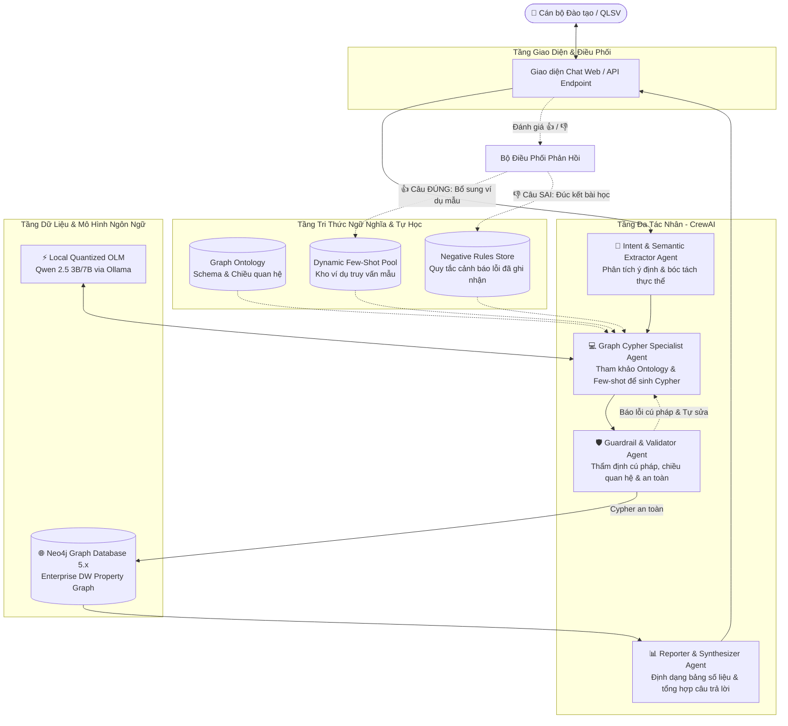

# KIẾN TRÚC KỸ THUẬT: EDU-GRAPH AGENT SYSTEM
## Technical Architecture & Multi-Agent Design Document

---

## 1. TỔNG QUAN KIẾN TRÚC HỆ THỐNG

Hệ thống được thiết kế theo mô hình **Multi-Agent Decoupled Architecture**, phân tách triệt để giữa tầng giao tiếp người dùng, tầng suy luận đồ thị, tầng an toàn và tầng thực thi cơ sở dữ liệu.



---

## 2. CHI TIẾT CÁC TÁC NHÂN TRONG CREWAI

### 2.1. Intent & Semantic Extractor Agent
- **Vai trò**: Phân tích câu hỏi tiếng Việt của người dùng, xác định bản chất câu hỏi và trích xuất các thực thể liên quan.
- **Nhiệm vụ**:
  - Xác định miền nghiệp vụ: *Điểm danh (Attendance)*, *Hồ sơ sinh viên (Profile)*, *Trạng thái học vụ (Status History)*, hay *Đánh giá kết quả (Assessment)*.
  - Bóc tách thực thể: Mã sinh viên, họ tên (hỗ trợ tìm kiếm xấp xỉ), mã lớp phần (`PRO192`), học kỳ (`FA2024`), khoảng thời gian (ngày, tháng).
  - Nhận diện các toán tử logic: phủ định (*không vắng*), so sánh (*vắng > 2 buổi*, *điểm < 5*), kết hợp đa điều kiện.

### 2.2. Graph Cypher Specialist Agent
- **Vai trò**: Chuyên gia thiết kế câu truy vấn Cypher tối ưu và chính xác cho Neo4j.
- **Nguyên tắc hoạt động**:
  - Không sinh bừa bãi; bắt buộc tuân theo **Compact Graph Ontology** (xem Phần 4).
  - Đọc các ví dụ từ **Dynamic Few-Shot Pool** có ngữ nghĩa tương đồng nhất để định hình cấu trúc câu lệnh.
  - Kiểm tra các **Negative Rules** để không vi phạm các lỗi nghiệp vụ đã từng xảy ra trong quá khứ.
  - Tự động thêm `LIMIT` mặc định (ví dụ: `LIMIT 50`) để chống quá tải bộ nhớ khi truy vấn danh sách lớn.

### 2.3. Guardrail & Validator Agent
- **Vai trò**: "Người gác cổng" an toàn trước khi câu lệnh được chạm vào database.
- **Cơ chế kiểm soát**:
  - **Bảo mật (Read-Only Enforcement)**: Chặn đứng bất kỳ câu lệnh nào chứa các từ khóa ghi/xóa: `CREATE`, `MERGE`, `SET`, `DELETE`, `DETACH`, `REMOVE`, `DROP`, `CALL dbms.*`.
  - **Kiểm tra cú pháp (Syntax Validation)**: Sử dụng parser kiểm tra tính hợp lệ của câu lệnh Cypher trước khi thực thi.
  - **Vòng lặp tự sửa lỗi (Self-Correction Loop)**: Nếu câu lệnh bị lỗi cú pháp hoặc sai tên nhãn/thuộc tính, Agent này gửi lại chi tiết lỗi cho *Cypher Specialist Agent* yêu cầu viết lại (tối đa 2 lần lặp).

### 2.4. Reporter & Synthesizer Agent
- **Vai trò**: Chuyển đổi dữ liệu JSON trả về từ Neo4j thành câu trả lời tự nhiên, thân thiện và các bảng biểu trực quan theo định dạng Markdown cho cán bộ đào tạo.
- **Đầu ra**:
  - Bảng tổng hợp số liệu rõ ràng.
  - Điểm nhấn cảnh báo (Alert) với các trường hợp sinh viên đặc biệt (vắng nhiều, bảo lưu, học lực yếu).

---

## 3. THIẾT KẾ ĐỘNG 100% (LOẠI BỎ FAST-PATH) & CƠ CHẾ TỰ HỌC NHẸ

### 3.1. Lý do loại bỏ Fast-path
Việc dùng Regular Expression hoặc hardcoded template matching để định tuyến câu lệnh (Fast-Path) thường thất bại trong thực tế vì:
- Bắt nhầm từ khóa trong câu hỏi phủ định (Ví dụ: *"Cho danh sách lớp không vắng ai"* bị bắt nhầm thành tìm sinh viên vắng).
- Không thích ứng được khi cán bộ đào tạo bổ sung điều kiện lọc phức tạp ngoài khuôn mẫu có sẵn.
Do đó, hệ thống vận hành **100% qua quy trình suy luận động của OLM**.

### 3.2. Vòng lặp Học hỏi Ngữ nghĩa (Semantic Experience Loop)
Để hệ thống thông minh hơn mà **không cần Retrain hay Fine-tune model** (vốn rất nặng và tốn kém GPU):

1. **Bộ nhớ Ví dụ Tích lũy (Dynamic Few-Shot Pool)**:
   - Lưu trữ các cặp `(Câu hỏi người dùng, Câu lệnh Cypher chuẩn)` đã được xác thực là đúng.
   - Khi có câu hỏi mới, hệ thống tìm kiếm 1-2 mẫu gần nhất bằng độ tương đồng ngữ nghĩa để làm ngữ cảnh tham khảo cho OLM. OLM sẽ dựa vào đó để tự sinh Cypher mới cho câu hỏi hiện tại.
2. **Sổ tay Quy tắc Phòng ngừa (Negative Rules Store)**:
   - Khi người dùng phản hồi một câu trả lời là sai hoặc chỉnh sửa lại câu lệnh, hệ thống trích xuất bài học:
     *Ví dụ: "Khi cán bộ hỏi 'sinh viên vắng', chỉ tính `attendance_status = 'ABSENT'`, không tính các buổi `LATE` (đi muộn)."*
   - Quy tắc này được tự động bổ sung vào System Prompt của Agent sinh Cypher ở các phiên làm việc tiếp theo.

---

## 4. BẢN ĐỒ ĐỒ THỊ TỐI GIẢN (COMPACT GRAPH ONTOLOGY)

Để OLM kích thước nhỏ (3B - 7B) không bị ảo giác, ta cung cấp bản đồ cấu trúc quan hệ có định hướng nghiêm ngặt sau:

```cypher
// 1. Con người và Vai trò
(:Person {full_name, national_id, email, phone, gender}) -[:HAS_ROLE]-> (:Student {student_code, program_code, enrollment_date, is_active})
(:Person {full_name, national_id, email, phone, gender}) -[:HAS_ROLE]-> (:Employee {employee_code, hire_date, is_active})

// 2. Nhân sự & Giảng dạy
(:Employee) -[:ASSIGNED_TO_DEPT {position_code, assignment_type, employment_status}]-> (:Department {dept_code, dept_name})
(:Employee) -[:LEADS {role: 'PRIMARY_LECTURER' | 'TEACHING_ASSISTANT'}]-> (:Activity)

// 3. Lớp học & Buổi học
(:Class {class_code, class_name, class_type, max_capacity}) -[:OFFERED_IN]-> (:AcademicPeriod {period_code, period_name, start_date, end_date})
(:Activity {class_code, scheduled_date, activity_name, activity_type: 'LECTURE'|'LAB'|'EXAM', duration_minutes}) -[:PART_OF]-> (:Class)

// 4. Sinh viên & Tham gia học
(:Student) -[:STUDIES_AT]-> (:Organization {org_code, org_name})
(:Student) -[:ENROLLED_IN {enrolled_at, status}]-> (:Class)
(:Student) -[:PARTICIPATED_IN {participation_date, attendance_status: 'PRESENT'|'ABSENT'|'LATE', quiz_score, assignment_score, grade}]-> (:Activity)

// 5. Lịch sử trạng thái học vụ (Vòng lặp)
(:Student) -[:HAS_STATUS {status: 'ACTIVE'|'SUSPENDED'|'GRADUATED'|'DROPOUT', effective_from, effective_to, note}]-> (:Student)
```

---

## 5. TỪ ĐIỂN QUY ƯỚC NGHIỆP VỤ (BUSINESS SEMANTIC RULES)

| Khái niệm Nghiệp vụ | Quy tắc Cypher bắt buộc |
| :--- | :--- |
| **Sinh viên đang theo học** | `(s:Student {is_active: true})` và `(s)-[st:HAS_STATUS]->(s) WHERE st.status = 'ACTIVE' AND st.effective_to IS NULL` |
| **Sinh viên đang bảo lưu** | `(s:Student)-[st:HAS_STATUS]->(s) WHERE st.status = 'SUSPENDED' AND st.effective_to IS NULL` |
| **Sinh viên từng bảo lưu rồi quay lại học** | `(s:Student)-[st:HAS_STATUS]->(s) WHERE st.status = 'SUSPENDED' AND st.effective_to IS NOT NULL` |
| **Sinh viên vắng mặt** | `part.attendance_status = 'ABSENT'` |
| **Sinh viên đi muộn** | `part.attendance_status = 'LATE'` |
| **Giảng viên chính phụ trách** | `(e:Employee)-[:LEADS {role: 'PRIMARY_LECTURER'}]->(a:Activity)` |
| **Trợ giảng phụ trách** | `(e:Employee)-[:LEADS {role: 'TEACHING_ASSISTANT'}]->(a:Activity)` |
| **Tìm kiếm tên không phân biệt hoa thường** | `toLower(p.full_name) CONTAINS toLower('tên_cần_tìm')` hoặc `=~ '(?i).*tên.*'` |

---

## 6. CẤU TRÚC THƯ MỤC DỰ ÁN KHUYẾN NGHỊ

```text
CrewAI-neo4j/
├── _bmad/                         # Cấu hình BMad Method & Tools
├── _bmad-output/                  # Thư mục lưu trữ artifact (planning, reports)
├── docs/                          # Tài liệu kiến trúc và đặc tả dự án
│   ├── PROJECT_SPEC.md            # Đặc tả yêu cầu và phạm vi nghiệp vụ
│   └── ARCHITECTURE.md            # Kiến trúc kỹ thuật và thiết kế Agent
├── enterprise_dw_neo4j (1).cypher # File seed schema & dữ liệu mẫu Neo4j
├── src/                           # Mã nguồn chính của hệ thống
│   ├── agents/                    # Định nghĩa các Agent trong CrewAI
│   │   ├── router_agent.py        # Agent bóc tách ý định & thực thể
│   │   ├── cypher_agent.py        # Agent sinh câu lệnh Cypher
│   │   ├── validator_agent.py     # Agent thẩm định an toàn & cú pháp
│   │   └── reporter_agent.py      # Agent tổng hợp báo cáo
│   ├── crew/                      # Thiết lập quy trình CrewAI & Task flow
│   │   └── edu_crew.py            # Khởi tạo và điều phối Crew
│   ├── db/                        # Kết nối và tương tác Neo4j
│   │   ├── neo4j_client.py        # Driver kết nối Neo4j
│   │   └── schema_provider.py    # Cung cấp Ontology & Schema định hướng
│   ├── memory/                    # Bộ nhớ kinh nghiệm & Phản hồi
│   │   ├── few_shot_pool.py       # Quản lý kho ví dụ mẫu (Few-shot)
│   │   ├── rules_store.py         # Quản lý các quy tắc nghiệp vụ / bẫy cần tránh
│   │   └── feedback_manager.py    # Xử lý đánh giá 👍 / 👎 từ người dùng
│   └── config.py                  # Cấu hình kết nối Neo4j, Ollama, model
├── tests/                         # Kiểm thử tự động câu lệnh Cypher & Agent
├── main.py                        # Điểm khởi chạy chương trình (CLI / API)
├── requirements.txt               # Danh sách thư viện Python
└── README.md                      # Hướng dẫn cài đặt & vận hành
```
