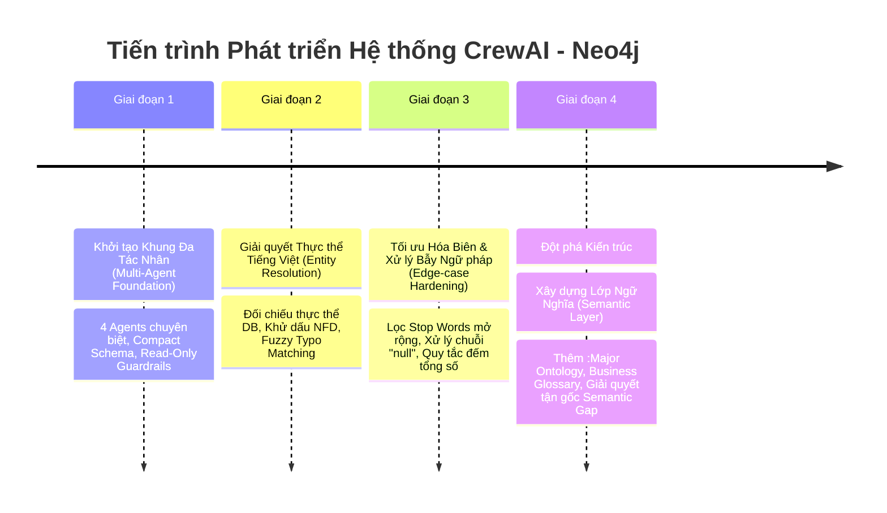

# 📜 LỊCH SỬ PHÁT TRIỂN & BÁO CÁO THAY ĐỔI DỰ ÁN (PROJECT HISTORY & CHANGELOG)

Tài liệu này ghi lại toàn bộ quá trình tiến hóa kiến trúc, các vấn đề kỹ thuật phát sinh, mục tiêu cốt lõi của từng giai đoạn và những giải pháp đột phá đã được triển khai trong hệ thống **Trợ Lý Đào Tạo Thông Minh CrewAI - Neo4j**.

---

## 🎯 1. TỔNG QUAN VỀ SỨ MỆNH & MỤC TIÊU DỰ ÁN

### Bối cảnh bài toán
Phòng Đào tạo và Quản lý Sinh viên quản lý một khối lượng dữ liệu học vụ lớn và phức tạp trên đồ thị tri thức Neo4j: con người, sinh viên, cán bộ, cơ sở đào tạo, lớp học, buổi học, điểm danh, điểm số, và lịch sử trạng thái (bảo lưu, thôi học, tốt nghiệp).

### Mục tiêu cốt lõi
1. **Giao diện tự nhiên bằng Tiếng Việt**: Cán bộ đào tạo có thể đặt bất kỳ câu hỏi nào bằng ngôn ngữ tự nhiên hàng ngày.
2. **100% Dynamic Semantic Reasoning**: Không dùng các giải pháp "ăn xổi" như regex cứng nhắc (Hardcoded Regex) hay Fast-path; toàn bộ quy trình phải đi qua tư duy suy luận đồ thị của mạng lưới Multi-Agent.
3. **Chạy hoàn toàn cục bộ (Privacy & Local-first)**: Sử dụng mô hình ngôn ngữ mã nguồn mở cục bộ (`qwen2.5:3b` qua Ollama), bảo mật 100% dữ liệu sinh viên trong mạng nội bộ.
4. **An toàn & Tự phục hồi (Guardrails & Self-Healing)**: Chỉ cho phép truy vấn đọc (Read-Only), tự động thêm LIMIT, tự sửa lỗi cú pháp Cypher khi gặp lỗi thực thi.

---

## 📅 2. CÁC GIAI ĐOẠN TIẾN HÓA KIẾN TRÚC

---

### GIAI ĐOẠN 1: Khởi tạo Khung Đa Tác Nhân (Multi-Agent Foundation)
* **Commit**: `2737018` - *Initial commit: CrewAI Neo4j project*
* **Mục tiêu**: Xây dựng pipeline 4 Agent chuyên biệt theo kiến trúc CrewAI.

#### Các thành phần đã làm:
1. **Router Agent (`router_agent.py`)**: Đọc câu hỏi và trích xuất ý định (`attendance_query`, `warning_query`, `status_query`, v.v.) và thực thể thô dạng JSON.
2. **Cypher Specialist Agent (`cypher_agent.py`)**: Nạp `COMPACT_GRAPH_ONTOLOGY`, `BUSINESS_SEMANTIC_RULES` và `few_shots` để chuyển câu hỏi thành Cypher 5.x.
3. **Validator Agent (`validator_agent.py`)**: Kiểm duyệt câu Cypher, chặn các từ khóa ghi/xóa (`CREATE`, `DELETE`, `MERGE`, `DROP`), tự bổ sung `LIMIT 50` và cơ chế phản tỉnh (Self-Correction loop) khi Neo4j báo lỗi cú pháp.
4. **Reporter Agent (`reporter_agent.py`)**: Chuyển bản ghi dữ liệu thô từ Neo4j thành bảng Markdown trực quan.

#### Vấn đề gặp phải:
- Mô hình `qwen2.5:3b` là dòng mô hình nhỏ, khi người dùng gõ sai chính tả hoặc sai dấu thanh tiếng Việt (ví dụ: *"lé khắc tiệp"* thay vì *"Lê Khắc Tiệp"*), OLM đưa nguyên chuỗi sai vào mệnh đề `WHERE` dẫn đến việc Cypher luôn trả về **0 kết quả**.

---

### GIAI ĐOẠN 2: Giải quyết Thực thể Tiếng Việt (Ground Truth Entity Resolution)
* **Commit**: `a69bf7f` - *docs: update comprehensive README with architecture, entity resolver and setup guide*
* **Mục tiêu**: Xây dựng cầu nối chuẩn hóa thực thể dựa trên dữ liệu thật của cơ sở dữ liệu (Database-Grounded Entity Resolver).

#### Các thành phần đã làm:
1. **Xây dựng `src/db/entity_resolver.py`**:
   - Tải toàn bộ danh sách họ tên sinh viên, cán bộ và cơ sở đào tạo từ Neo4j vào bộ nhớ đệm (Cache) khi khởi động.
   - Hàm chuẩn hóa ngữ âm `remove_vietnamese_accents()` dựa trên chuẩn Unicodedata NFD.
   - Thuật toán so khớp đa tầng:
     + Tầng 1: Khớp chính xác không dấu.
     + Tầng 2: Khớp hoán vị họ tên (đảo từ: *"duyên đặng"* $\leftrightarrow$ *"đặng thị mỹ duyên"*).
     + Tầng 3: Substring matching & N-gram scanning.
     + Tầng 4: Fuzzy sequence matching bằng `difflib.SequenceMatcher` để phát hiện lỗi gõ sai chữ cái.
2. **Cơ chế Self-Healing trên Validator Agent**:
   - Nếu câu lệnh Cypher thực thi trả về 0 bản ghi và có chứa điều kiện lọc họ tên, Validator tự động chuyển sang điều kiện tìm kiếm mềm `CONTAINS toLower(...)` để vớt dữ liệu.

---

### GIAI ĐOẠN 3: Tối ưu Hóa Biên & Xử lý Bẫy Ngữ Pháp (Edge-case Hardening)
* **Commit**: `98c47d3` - *fix: resolve false entity matching on adverbs, sanitize null entities, and add count aggregation rule*
* **Mục tiêu**: Khắc phục các lỗi sinh Cypher sai do bẫy từ ngữ và định dạng JSON từ OLM.

#### Các vấn đề phát sinh từ thực tế:
1. **Bẫy trạng từ thời gian**: Người dùng hỏi *"số sinh viên **đang** bảo lưu"*. Từ *"đang"* là một từ đơn, thuật toán fuzzy substring matching trước đó đã ghép nhầm *"đang"* thành sinh viên *"Vũ Hải Đăng"*, làm AI gán cứng điều kiện `p.full_name = 'Vũ Hải Đăng'`.
2. **Bẫy chuỗi `"null"`**: OLM nhỏ thường sinh JSON dạng `"student_name": "null"`. Trong Python, chuỗi `"null"` không rỗng nên được coi là `True`, dẫn đến việc Entity Resolver tìm kiếm người có tên là "null".
3. **Logic đảo ngược thời gian**: Câu hỏi bảo lưu yêu cầu sinh viên chưa hết hạn (`st.effective_to IS NULL`), nhưng Cypher lại sinh thành `st.effective_to IS NOT NULL`.
4. **Sai dạng tổng hợp (Aggregation)**: Khi hỏi *"Số sinh viên..."*, mô hình trả về danh sách 50 mã thay vì dùng hàm đếm `count(DISTINCT s)`.

#### Các giải pháp đã triển khai:
- Mở rộng tập từ dừng `STOP_WORDS` trong `entity_resolver.py` gồm toàn bộ phó từ, trạng từ và thuật ngữ học vụ (*đang, đã, từng, số, lượng, bao, nhiêu, bảo, lưu, cấm, thi, vắng...*).
- Siết chặt điều kiện: Chuỗi tìm kiếm phải có từ 2 từ trở lên và có độ tương đồng $\ge 0.5$ mới xét khớp tên người.
- Bộ lọc làm sạch dữ liệu trong `router_agent.py` và `entity_resolver.py`: Tự động chuyển toàn bộ chuỗi `"null"`, `"none"`, `""` thành `None`.
- Bổ sung **Quy tắc 15 (Hỏi số lượng / Đếm tổng số)** vào `schema_provider.py`: Bắt buộc dùng `RETURN count(DISTINCT s) AS ...`.

---

### GIAI ĐOẠN 4: Đột phá Kiến trúc - Xây dựng Lớp Ngữ Nghĩa (Semantic Layer & Ontology)
* **Commit**: `c5ea00e` - *feat: implement Semantic Layer for business glossary, major ontology, and concept queries*
* **Mục tiêu cốt lõi**: Giải quyết triệt để **Semantic Gap (Hố sâu ngữ nghĩa)**; chấm dứt tình trạng "vá víu" thủ công từng câu few-shot; hỗ trợ câu hỏi khái niệm/tri thức.

#### Khởi nguồn từ câu hỏi thực tế của người dùng:
> *"mã SE là ngành gì tức là tôi đang thắc mắc là nó có biết suy luận không MATCH (p:Person)-[:HAS_ROLE]->(s:Student) WHERE s.program_code = 'SE' RETURN s.program_code AS ma_nganh LIMIT 50 tại nếu mỗi câu trả lời sai tôi lại sửa như vậy thì bao giờ mới hết những trường hợp khác"*

#### Bóc tách nguyên nhân sâu xa:
1. **Khoảng trống dữ liệu**: Trong Neo4j trước đây, **hoàn toàn không có nút hay thuộc tính nào lưu chữ "Kỹ thuật phần mềm"**. `program_code = 'SE'` chỉ là chuỗi chữ cái nằm chết trên nút `Student`. Kể cả chuyên gia con người cũng không thể viết lệnh Cypher để SELECT ra chữ "Kỹ thuật phần mềm".
2. **Ép buộc sinh Cypher máy móc**: Hệ thống ép mọi câu hỏi đều phải sinh Cypher, khiến AI rơi vào thế kẹt và sinh câu lệnh vô nghĩa.
3. **Mô hình 3B cần Semantic Guardrails**: Không có tầng ngữ nghĩa, mô hình nhỏ không thể tự suy luận từ đồng nghĩa (*"kỹ thuật phần mềm"* $\leftrightarrow$ `SE`, *"an ninh mạng"* $\leftrightarrow$ `IA`).

#### Giải pháp toàn diện đã triển khai:
1. **Khởi tạo Đồ thị tri thức ngành học trong Neo4j (`:Major` Ontology)**:
   - Viết script migration [scripts/seed_major_ontology.py](file:///d:/NHG/CrewAI-neo4j/scripts/seed_major_ontology.py) nạp 6 nút ngành chuẩn:
     + `SE`: Kỹ thuật phần mềm (Software Engineering) - Kỹ sư
     + `AI`: Trí tuệ nhân tạo (Artificial Intelligence) - Kỹ sư
     + `IA`: An toàn thông tin (Information Assurance) - Kỹ sư
     + `BA`: Quản trị kinh doanh (Business Administration) - Cử nhân
     + `GD`: Thiết kế mỹ thuật số (Graphic Design) - Cử nhân
     + `IS`: Hệ thống thông tin (Information Systems) - Kỹ sư
   - Tự động liên kết quan hệ đồ thị cho 48 sinh viên:
     `(:Student) -[:MAJORS_IN]-> (:Major)` (bảo lưu thuộc tính `s.program_code` để tương thích ngược 100%).

2. **Xây dựng Module Lớp Ngữ Nghĩa ([src/db/semantic_layer.py](file:///d:/NHG/CrewAI-neo4j/src/db/semantic_layer.py))**:
   - **Major Glossary & Synonyms**: Lưu trữ toàn bộ từ đồng nghĩa đời thực (*"phần mềm", "lập trình", "an ninh mạng", "bảo mật", "trí tuệ nhân tạo", "khoa học dữ liệu"*).
   - **Campus Glossary**: Ánh xạ địa danh tự nhiên (*"Hòa Lạc", "Hà Nội", "Sài Gòn", "Đà Nẵng"*) về mã tổ chức (`FPTU-HN`, `FPTU-HCM`, `FPTU-DN`).
   - **Status Metrics**: Chuẩn hóa công thức Cypher cho các trạng thái học vụ.

3. **Nâng cấp Entity Resolver với Semantic Layer**:
   - Tự động nhận diện từ đồng nghĩa trong câu hỏi:
     + *"sinh viên ngành kỹ thuật phần mềm"* $\longrightarrow$ `program_code: 'SE'`
     + *"sinh viên an ninh mạng ở đà nẵng"* $\longrightarrow$ `program_code: 'IA'`, `campus: 'FPTU-DN'`
     + *"sinh viên trí tuệ nhân tạo ở hòa lạc"* $\longrightarrow$ `program_code: 'AI'`, `campus: 'FPTU-HN'`

4. **Hỗ trợ Tra cứu Khái niệm / Định nghĩa (Knowledge Queries)**:
   - **Router Agent**: Bổ sung intent `knowledge_query`.
   - **Schema Provider**: Bổ sung **Quy tắc 16**, chỉ dẫn mô hình khi hỏi về mã/khái niệm ngành học thì truy vấn trực tiếp nút `(:Major)`.
   - **Reporter Agent**: Thiết kế Thẻ Thông Tin Chuyên Ngành (Concept Card) hiển thị đầy đủ tên tiếng Việt, tên tiếng Anh, văn bằng tốt nghiệp và mô tả chuyên môn.

---

## 📊 3. BẢNG TỔNG KẾT THAY ĐỔI & HIỆU QUẢ KIẾN TRÚC

| Tiêu chí | Trước khi có Semantic Layer | Sau khi triển khai Semantic Layer |
| :--- | :--- | :--- |
| **Xử lý từ đồng nghĩa** | Thất bại nếu câu hỏi không dùng đúng mã viết tắt (`SE`, `IA`). | Tự động ánh xạ 100% các từ đời thực (*"kỹ thuật phần mềm"*, *"an ninh mạng"*, *"trí tuệ nhân tạo"*) về mã chuẩn. |
| **Câu hỏi khái niệm ("Mã SE là ngành gì")** | Sinh Cypher ngô nghê chọc vào Student, trả về danh sách vô nghĩa. | Nhận diện `knowledge_query`, truy vấn nút `:Major`, hiển thị thẻ thông tin chuyên ngành chuẩn xác. |
| **Quy mô bảo trì** | Phải thêm Few-shot thủ công cho từng trường hợp phát sinh. | **Tổng quát hóa (Generalization)**: Định nghĩa 1 lần trong Semantic Layer, hàng nghìn câu hỏi liên quan đều tự động chạy đúng. |
| **Độ ổn định mô hình 3B** | Dễ bị quá tải, suy luận sai khi gặp câu hỏi lạ. | Mô hình nhỏ chạy cực kỳ ổn định vì ngữ cảnh và thực thể đã được chuẩn hóa sẵn. |

---

## 📂 4. DANH SÁCH COMMITS TRÊN REPOSITORY

| Commit Hash | Thời gian | Tác vụ & Nội dung thay đổi |
| :--- | :--- | :--- |
| `2737018` | 2026-09-05 | **Initial commit**: Khởi tạo khung dự án CrewAI + Neo4j + Ollama (`qwen2.5:3b`). |
| `a69bf7f` | 2026-09-06 | **feat(resolver)**: Bổ sung Entity Resolver đối chiếu thực thể DB, khử dấu tiếng Việt, fuzzy typo matching và cập nhật README. |
| `98c47d3` | 2026-09-06 | **fix(guardrails)**: Mở rộng Stop Words, xử lý chuỗi "null", thêm Quy tắc 15 đếm tổng số `count(DISTINCT s)`. |
| `c5ea00e` | 2026-09-06 | **feat(semantic-layer)**: Xây dựng Semantic Layer, Business Glossary, Major Ontology trong Neo4j, giải quyết câu hỏi khái niệm. |

---

*Báo cáo được biên soạn và cập nhật tự động vào hệ thống tài liệu dự án.*
