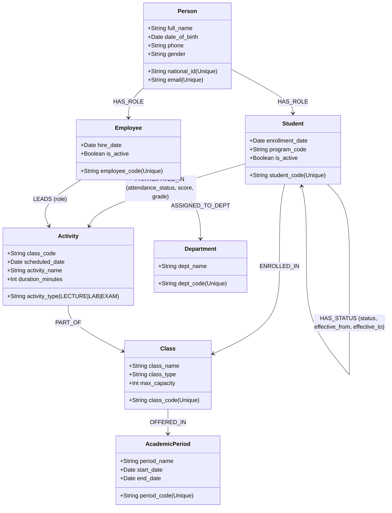

# ĐẶC TẢ DỰ ÁN: EDU-GRAPH MULTI-AGENT ASSISTANT
## Hệ thống Trợ lý AI Đa tác nhân Quản lý Đào tạo & Sinh viên trên Cơ sở Dữ liệu Đồ thị Neo4j

---

## 1. TỔNG QUAN DỰ ÁN

### 1.1. Bối cảnh
Trong môi trường giáo dục đại học, dữ liệu quản lý sinh viên, giảng viên, lớp học phần, lịch trình buổi học và điểm danh có mối quan hệ đa tầng, liên kết chặt chẽ và thay đổi theo thời gian (State-Duration).
- Cơ sở dữ liệu quan hệ truyền thống (RDBMS/SQL) đòi hỏi phải `JOIN` từ 6 đến 9 bảng cho các câu hỏi đào tạo thực tế, gây chậm và cú pháp truy vấn phức tạp.
- Cán bộ Phòng Đào tạo & Quản lý Sinh viên (QLSV) thường xuyên có nhu cầu tra cứu linh hoạt, đột xuất bằng ngôn ngữ tự nhiên nhưng việc viết truy vấn kỹ thuật (SQL/Cypher) là rào cản lớn.

### 1.2. Mục tiêu giải pháp
Xây dựng hệ sinh thái trợ lý ảo ứng dụng **Multi-Agent (CrewAI)** kết hợp với **Mô hình Ngôn ngữ Lượng tử hóa chạy nội bộ (Quantized Local OLM)** và **Cơ sở dữ liệu Đồ thị Neo4j 5.x**:
- Cho phép cán bộ đào tạo truy vấn thông tin bằng **tiếng Việt tự nhiên**.
- **100% On-Premise & Bảo mật**: Không gửi thông tin nhạy cảm (CCCD `national_id`, họ tên, điểm số, học bạ) lên Cloud hoặc dịch vụ bên thứ ba.
- **100% Dynamic Semantic Reasoning**: Không áp dụng cơ chế định tuyến cứng / Fast-path để tránh rủi ro định tuyến sai và hiểu sai ngữ cảnh phức tạp của câu hỏi.
- **Tự học nhẹ qua phản hồi (Semantic Experience Memory Loop)**: Hệ thống ghi nhận các câu trả lời chuẩn làm ví dụ tham khảo (Few-shot) và lưu các cảnh báo nghiệp vụ khi người dùng phản hồi, giúp OLM ngày càng chính xác mà không cần tốn tài nguyên huấn luyện lại (fine-tuning).

---

## 2. NỀN TẢNG DỮ LIỆU ĐỒ THỊ (NEO4J PROPERTY GRAPH)

Dữ liệu nguồn được chuẩn hóa từ file [`enterprise_dw_neo4j (1).cypher`](../enterprise_dw_neo4j%20(1).cypher) với các miền dữ liệu chính:

### Các đặc tính cốt lõi của mô hình:
1. **Party Model (Single Source of Truth)**: Mỗi con người là duy nhất một nút `(:Person)`, đóng các vai trò qua nút `(:Student)` hoặc `(:Employee)`. Hỗ trợ triệt để trường hợp sinh viên kiêm trợ giảng (`TA` - Dual-role).
2. **State-Duration Fact (Lịch sử trạng thái)**: Trạng thái học vụ của sinh viên được lưu dưới dạng quan hệ hồi tiếp `(Student)-[r:HAS_STATUS]->(Student)` kèm thời hạn hiệu lực (`effective_from`, `effective_to`), ghi nhận trạng thái: `ACTIVE`, `SUSPENDED` (bảo lưu), `GRADUATED` (tốt nghiệp), `DROPOUT` (thôi học).
3. **Transaction Fact (Điểm danh & Đánh giá)**: Quan hệ `(Student)-[r:PARTICIPATED_IN]->(Activity)` lưu trữ trực tiếp trạng thái chuyên cần (`PRESENT`, `ABSENT`, `LATE`) và điểm số (`quiz_score`, `assignment_score`, `grade`).
4. **Giảng dạy qua Buổi học**: Giảng viên không nối trực tiếp với sinh viên mà liên kết qua hoạt động giảng dạy `(Employee)-[:LEADS]->(Activity)`.

---

## 3. PHẠM VI NGHIỆP VỤ & LỘ TRÌNH TRIỂN KHAI

### 3.1. Giai đoạn 1: Nghiệp vụ Phòng Đào tạo & Quản lý Sinh viên cơ bản
- **Tra cứu hồ sơ & vai trò**:
  - Tìm kiếm sinh viên theo tên, mã sinh viên, ngành học, khóa tuyển sinh.
  - Nhận diện các trường hợp kiêm nhiệm vai trò (sinh viên làm trợ giảng TA).
- **Quản lý chuyên cần & điểm danh**:
  - Tra cứu sinh viên vắng mặt, đi muộn theo từng lớp học phần hoặc theo ngày cụ thể.
  - Tổng hợp số buổi vắng của từng sinh viên theo từng môn học.
- **Theo dõi biến động học vụ**:
  - Tra cứu danh sách sinh viên đang trong thời gian bảo lưu (`SUSPENDED`).
  - Lịch sử thay đổi trạng thái của từng sinh viên (thời gian bắt đầu, kết thúc, lý do).
- **Tra cứu điểm số & đánh giá**:
  - Xem điểm quiz, điểm bài tập, điểm thi giữa kỳ và cuối kỳ.

### 3.2. Giai đoạn 2: Cảnh báo Sớm & Giám sát Tự động
- **Cảnh báo cấm thi chuyên cần**:
  - Tự động tính tỷ lệ vắng mặt: $\text{Tỷ lệ vắng} = \frac{\text{Số buổi vắng}}{\text{Tổng số buổi đã diễn ra}}$.
  - Cảnh báo các sinh viên chạm ngưỡng vắng $\ge 20\%$ để gửi thông báo cho cố vấn học tập.
- **Cảnh báo nguy cơ học vụ**:
  - Phát hiện sinh viên có điểm thi giữa kỳ dưới 5.0 hoặc không tham gia các buổi thực hành (LAB).
- **Báo cáo khối lượng giảng dạy**:
  - Thống kê tổng số giờ giảng và số buổi đứng lớp của giảng viên/trợ giảng trong kỳ.

### 3.3. Giai đoạn 3: Phân tích Đồ thị Nâng cao (Graph Analytics)
- Phát hiện các nút cổ chai trong môn học tiên quyết làm kéo dài thời gian tốt nghiệp.
- Phát hiện trùng lặp lịch biểu hoặc quá tải phòng học/giảng viên.
- Phân tích mạng lưới hỗ trợ học tập giữa các nhóm sinh viên trong cùng khoa.

---

## 4. QUY TẮC PHÁT TRIỂN & CHẤT LƯỢNG

1. **Bảo toàn tính toàn vẹn ngữ nghĩa**: Không sử dụng các bộ lọc từ khóa cứng (regex keywords) để ép câu hỏi vào khuôn mẫu cố định.
2. **Nguyên tắc Thẩm định trước khi Chạy (Validation Guardrail)**: Mọi câu lệnh Cypher do OLM sinh ra bắt buộc phải đi qua lớp thẩm định cú pháp và quy tắc an toàn (Read-Only: chỉ cho phép `MATCH`, `RETURN`, `WHERE`, `WITH`, `ORDER BY`, `LIMIT`; cấm tuyệt đối `DELETE`, `DETACH`, `CREATE`, `SET`, `MERGE`, `DROP`).
3. **Phản hồi thời gian thực**: Mục tiêu thời gian phản hồi cho một câu hỏi qua mô hình OLM cục bộ là dưới 15 giây trên CPU phổ thông.
