# 1. Mở đầu — Bài toán hiện hữu

Hệ thống hiện tại được xây dựng với mục tiêu tổ chức dữ liệu tài chính thành một mô hình có cấu trúc, có thể truy vấn, tổng hợp và kiểm tra theo các quy tắc nghiệp vụ.

Trọng tâm của hệ thống không nằm ở việc lấy dữ liệu từ đâu hay xử lý quá trình trích xuất dữ liệu như thế nào.

Phạm vi của kiến trúc bắt đầu từ thời điểm dữ liệu đã sẵn sàng để được tổ chức trong hệ thống.

Bài toán cần giải quyết là:

> Làm thế nào để tổ chức dữ liệu nghiệp vụ thành các domain rõ ràng, có quan hệ xác định, có khả năng mở rộng và có thể phục vụ cho cả quản lý vận hành lẫn phân tích dữ liệu?

Trong Financial Domain hiện hữu, hệ thống đã có các nhóm dữ liệu rõ ràng:

* Master Data.
* Metadata và Business Rules.
* Business Dimensions.
* Financial Facts.

Các thành phần này giúp hệ thống không chỉ lưu số liệu, mà còn hiểu ngữ nghĩa của số liệu.

Ví dụ:

* Số liệu thuộc công ty nào.
* Thuộc kỳ báo cáo nào.
* Là số phát sinh hay số dư.
* Có thể cộng dồn hay phải lấy giá trị cuối kỳ.
* Chỉ tiêu có quan hệ cha-con với chỉ tiêu nào.
* Chỉ tiêu được tính theo quy tắc nào.

Đây là nền tảng kiến trúc hiện hữu.

Giai đoạn tiếp theo là mở rộng mô hình dữ liệu để quản lý thêm các domain mới.

---

# 2. Bài toán mở rộng

Bên cạnh Financial Domain hiện hữu, hệ thống cần xây dựng thêm ba nhóm nghiệp vụ:

1. **Student Management**
2. **EDU — Quản lý hoạt động giáo dục**
3. **HR — Quản lý nhân sự**

Tuy nhiên, mục tiêu hiện tại không phải là xây dựng một Enterprise Platform hoàn chỉnh.

Mục tiêu là xây dựng một **Domain-First MVP**.

Điều đó có nghĩa là:

> Mỗi domain được xây dựng độc lập theo đúng nghiệp vụ của mình, nhưng các quan hệ giữa các domain được xác định ngay từ đầu.

Kiến trúc tổng thể được chia thành các cụm rõ ràng.

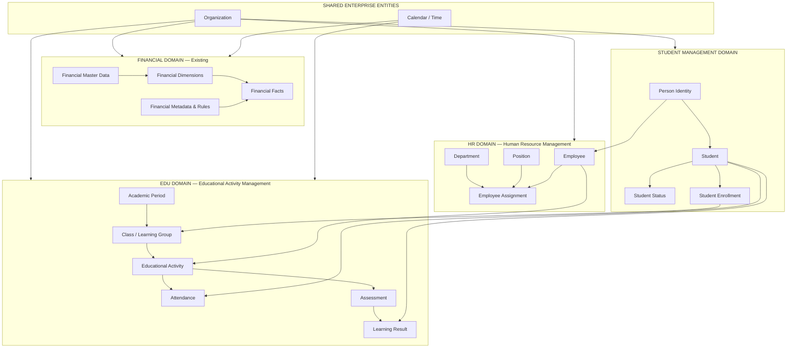

Trong kiến trúc này, mỗi khối là một cụm nghiệp vụ riêng.

Quan hệ giữa các cụm được giữ ở mức tối thiểu cần thiết cho MVP.

---

# 3. Cụm Shared Enterprise Entities

Đây là cụm chứa những thực thể có khả năng được sử dụng bởi nhiều domain.

Trong MVP, cụm này không nên phát triển thành một Master Data Management platform phức tạp.

Chỉ nên giữ các thực thể thực sự được dùng chung.

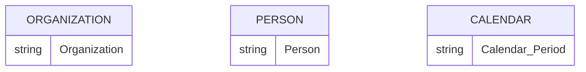

Hai khái niệm quan trọng nhất là:

**Person**

Person đại diện cho danh tính của một con người.

Person không đồng nghĩa với Student và cũng không đồng nghĩa với Employee.

Một Person có thể trở thành Student.

Một Person cũng có thể trở thành Employee.

Điều này giúp tránh việc lưu lặp thông tin cá nhân trong nhiều domain.

**Organization**

Organization là ngữ cảnh tổ chức dùng chung cho:

* HR.
* EDU.
* Financial.

Ví dụ một Employee thuộc Organization.

Một hoạt động giáo dục được tổ chức bởi Organization.

Financial data cũng thuộc phạm vi của Organization hoặc Company.

---

# 4. Student Management Domain

Student Management tập trung vào việc quản lý bản thân người học.

Domain này trả lời các câu hỏi:

* Người học là ai?
* Trạng thái hiện tại là gì?
* Đã đăng ký tham gia hoạt động hoặc lớp học nào?

Mô hình logic:

```mermaid
erDiagram

    PERSON ||--o| STUDENT : "has student identity"

    STUDENT ||--o{ STUDENT_STATUS_HISTORY : "has status history"

    STUDENT ||--o{ ENROLLMENT : "participates through"

    STUDENT {
        Student
    }

    STUDENT_STATUS_HISTORY {
        Status
        Effective_Period
    }

    ENROLLMENT {
        Enrollment
        Enrollment_Status
    }
```

Một nguyên tắc quan trọng là:

> Student là thực thể lâu dài, còn Enrollment là quan hệ tham gia tại một thời điểm hoặc trong một giai đoạn cụ thể.

Ví dụ một Student có thể tồn tại trong hệ thống nhiều năm.

Trong thời gian đó, Student có thể:

* Tham gia nhiều lớp.
* Tham gia nhiều hoạt động.
* Thay đổi trạng thái.
* Có nhiều giai đoạn học tập.

Vì vậy không nên gộp toàn bộ thông tin này vào Student.

---

# 5. EDU Domain — Quản lý hoạt động giáo dục

Phạm vi EDU trong MVP được giới hạn rõ ràng:

> EDU chỉ quản lý hoạt động giáo dục.

EDU không phải là một hệ thống quản lý toàn bộ chương trình đào tạo hay curriculum engine.

MVP tập trung vào:

* Hoạt động giáo dục.
* Lớp hoặc nhóm học.
* Thời gian diễn ra.
* Người phụ trách.
* Student tham gia.
* Điểm danh.
* Đánh giá và kết quả.

Luồng hoạt động:

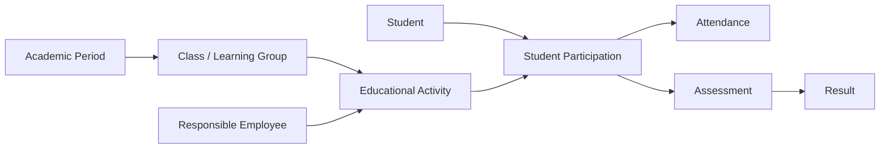

Điểm quan trọng là EDU không quản lý Student như một domain.

EDU chỉ quản lý:

> Student tham gia như thế nào vào một hoạt động giáo dục.

Do đó, Student thuộc Student Domain.

Educational Activity thuộc EDU Domain.

Mối quan hệ giữa hai domain được thể hiện thông qua Participation hoặc Enrollment.

---

# 6. Quan hệ Student và EDU

Đây là quan hệ quan trọng nhất trong mô hình mới.

```mermaid
erDiagram

    STUDENT ||--o{ ENROLLMENT : "has"

    CLASS ||--o{ ENROLLMENT : "contains"

    CLASS ||--o{ EDUCATIONAL_ACTIVITY : "organizes"

    ENROLLMENT ||--o{ ACTIVITY_PARTICIPATION : "participates"

    EDUCATIONAL_ACTIVITY ||--o{ ACTIVITY_PARTICIPATION : "has"

    ACTIVITY_PARTICIPATION ||--o{ ATTENDANCE : "records"

    ACTIVITY_PARTICIPATION ||--o{ ASSESSMENT_RESULT : "receives"
```

Business mapping:

```text
Student
    ↓
Enrollment
    ↓
Class
    ↓
Educational Activity
    ↓
Participation
    ├── Attendance
    └── Assessment Result
```

Nhờ tách các thực thể này, hệ thống có thể trả lời các câu hỏi khác nhau:

**Student Domain**

> Student này đang thuộc những lớp nào?

**EDU Domain**

> Hoạt động này có những Student nào tham gia?

**EDU Activity**

> Student đã tham gia bao nhiêu buổi?

**Assessment**

> Kết quả của Student trong hoạt động là gì?

---

# 7. HR Domain

HR chịu trách nhiệm quản lý nhân sự.

MVP HR tập trung vào:

* Employee.
* Department.
* Position.
* Employment Assignment.

```mermaid
erDiagram

    PERSON ||--o| EMPLOYEE : "has employee identity"

    EMPLOYEE ||--o{ EMPLOYMENT_ASSIGNMENT : "has"

    DEPARTMENT ||--o{ EMPLOYMENT_ASSIGNMENT : "contains"

    POSITION ||--o{ EMPLOYMENT_ASSIGNMENT : "defines"

    EMPLOYEE {
        Employee
    }

    DEPARTMENT {
        Department
    }

    POSITION {
        Position
    }

    EMPLOYMENT_ASSIGNMENT {
        Start_Date
        End_Date
        Employment_Status
    }
```

HR không trực tiếp quản lý hoạt động giáo dục.

Nhưng HR cung cấp Employee cho EDU.

---

# 8. Quan hệ HR và EDU

Một Employee có thể được phân công tham gia hoạt động giáo dục.

Ví dụ:

* Giáo viên.
* Giảng viên.
* Người phụ trách hoạt động.
* Người hỗ trợ hoạt động.

Mối quan hệ được mô hình hóa như sau:

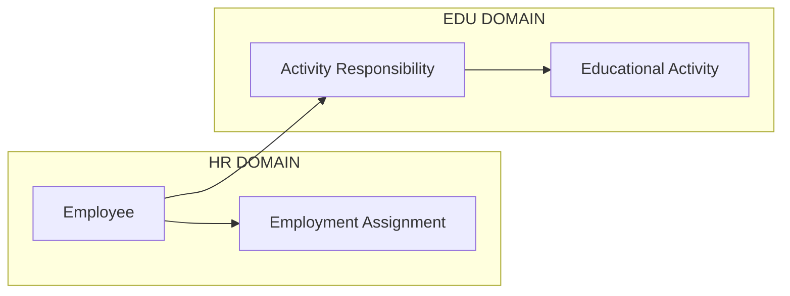

Nguyên tắc là:

> HR sở hữu Employee. EDU chỉ sử dụng Employee trong vai trò thực hiện hoạt động giáo dục.

Nhờ đó, không cần tạo một bảng Employee riêng trong EDU.

---

# 9. Quan hệ tổng thể giữa Student — EDU — HR

Ba domain được kết nối theo mô hình sau:

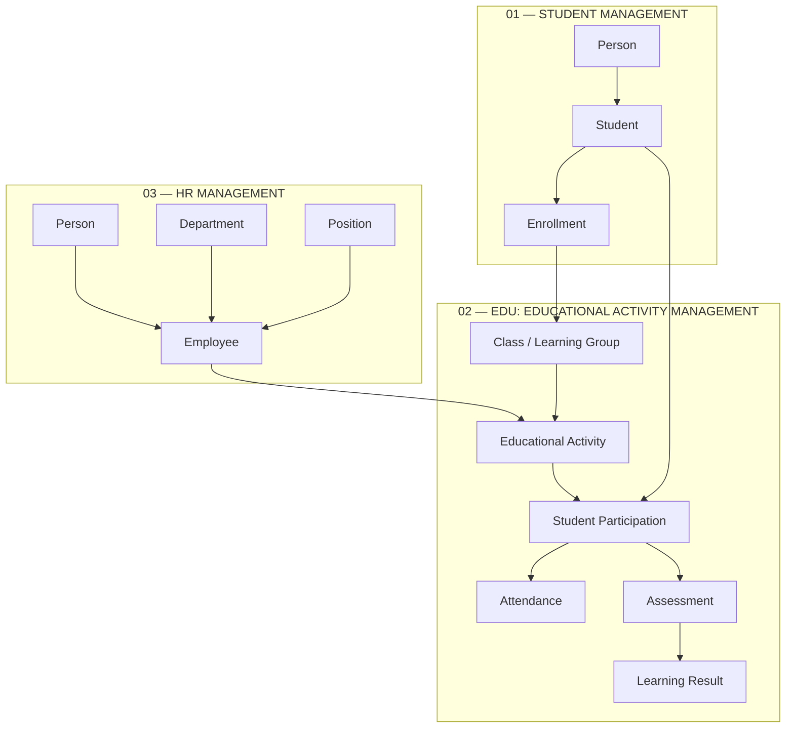

Mô hình này tạo ra ba ownership boundary rõ ràng:

| Domain  | Sở hữu dữ liệu                                                     |
| ------- | ------------------------------------------------------------------ |
| Student | Student identity, student status, enrollment                       |
| EDU     | Class, educational activity, participation, attendance, assessment |
| HR      | Employee, department, position, employment relationship            |

---

# 10. Financial Domain — Giữ độc lập

Financial Domain hiện hữu tiếp tục tồn tại như một domain riêng.

Nó không bị trộn trực tiếp với Student, EDU hoặc HR trong MVP.

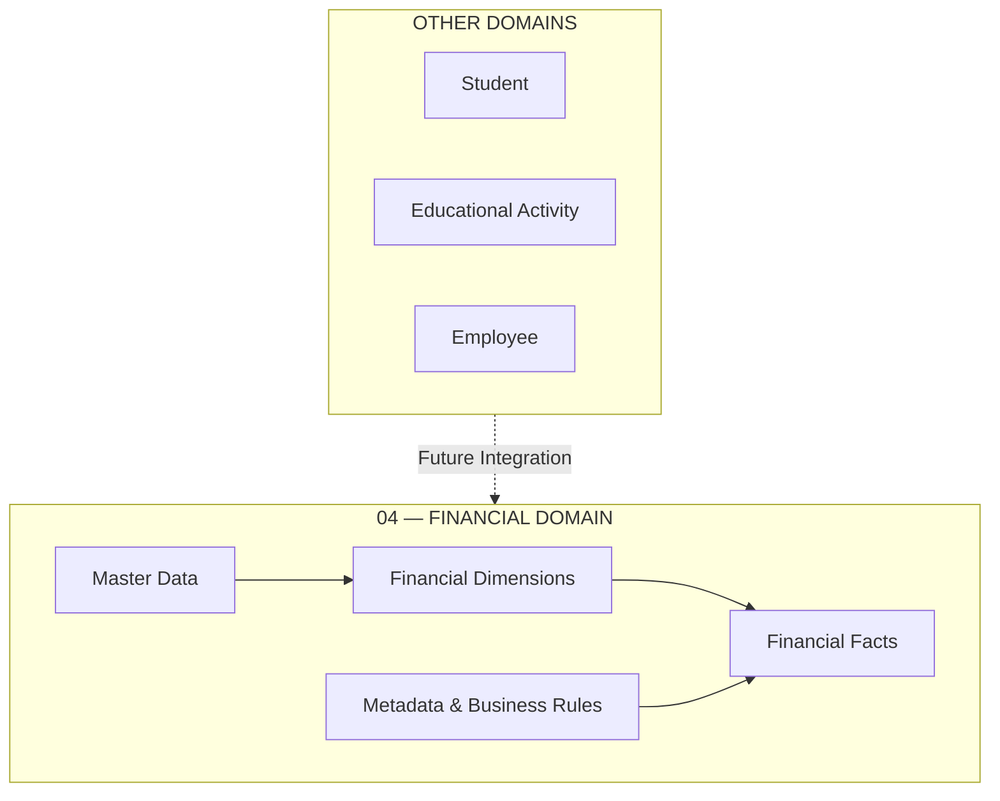

Lý do là Financial Domain hiện tại có business model và analytical semantics riêng.

Ví dụ:

* Balance.
* Flow.
* Financial aggregation.
* Financial statement hierarchy.
* Calculation rules.

Không nên cố gắng đồng nhất toàn bộ các khái niệm này với Student hoặc EDU chỉ vì chúng nằm trong cùng một hệ thống.

---

# 11. Target MVP Architecture

Kiến trúc MVP cuối cùng được chia thành bốn cụm chính.

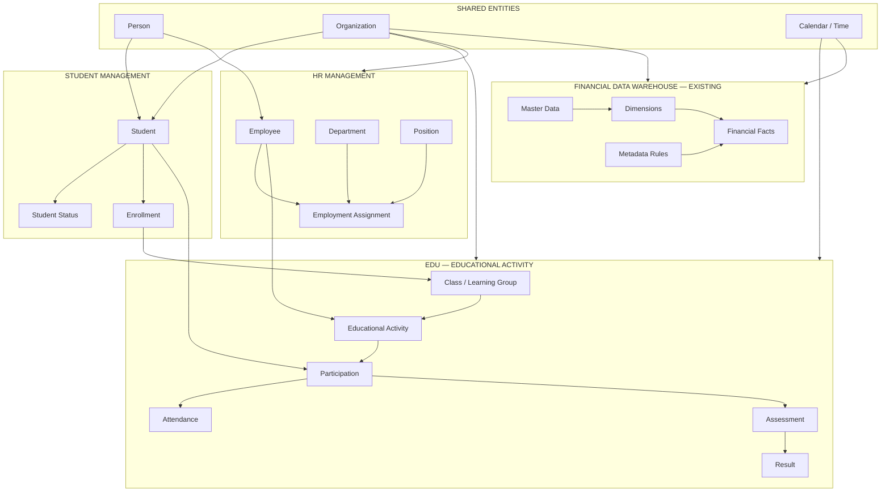

---

# 12. Architectural Trade-off — Chọn MVP Domain-First

Trong bài toán hiện tại, kiến trúc được lựa chọn rõ ràng là:

> **MVP Domain-First**

Điều này có nghĩa là không xây dựng Enterprise Platform hoàn chỉnh ngay từ đầu.

Không xây dựng ngay:

* Enterprise MDM.
* Generic workflow engine.
* Enterprise-wide metadata engine.
* Data Vault cho toàn bộ domain.
* Universal semantic layer.

Thay vào đó:

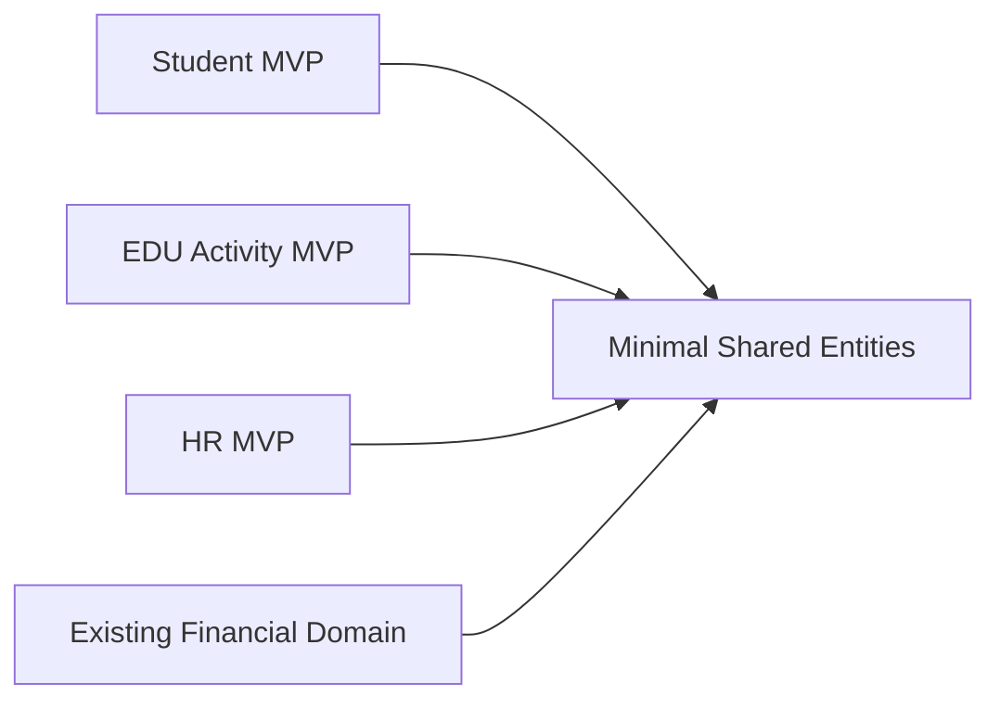

Mỗi domain được xây dựng để giải quyết bài toán nghiệp vụ của chính nó.

Shared layer chỉ chứa những thứ thực sự cần dùng chung.

---

# 13. Nguyên tắc thiết kế MVP

MVP Domain-First cần tuân theo các nguyên tắc sau.

## Nguyên tắc 1 — Ownership rõ ràng

Mỗi dữ liệu phải có một domain chịu trách nhiệm chính.

```text
Student → Student Domain

Educational Activity → EDU Domain

Employee → HR Domain

Financial Amount → Financial Domain
```

Không có hai domain cùng sở hữu cùng một business entity.

---

## Nguyên tắc 2 — Chỉ chia sẻ identity khi cần thiết

Student và Employee có thể cùng liên quan đến Person.

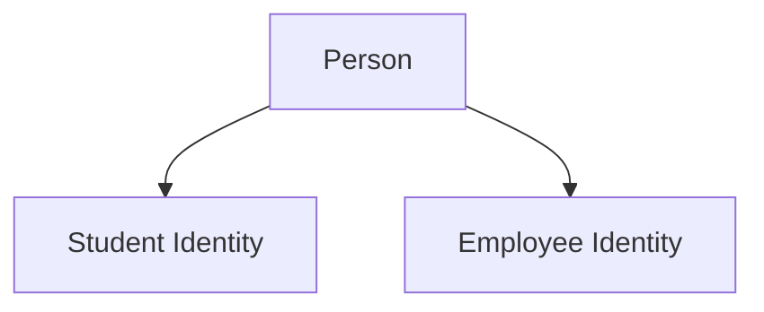

Nhưng Student không phải Employee.

Employee cũng không phải Student.

---

## Nguyên tắc 3 — Quan hệ liên domain thông qua Business Relationship

EDU không sở hữu Student.

EDU chỉ quản lý quan hệ:

> Student tham gia Educational Activity.

HR không sở hữu Educational Activity.

HR chỉ cung cấp Employee để được phân công vào hoạt động.

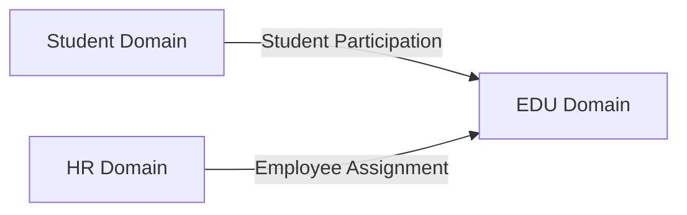

---

## Nguyên tắc 4 — Không over-engineer

MVP chỉ xây dựng những entity cần để vận hành nghiệp vụ.

Ví dụ EDU MVP không cần ngay:

* Curriculum engine phức tạp.
* Learning outcome framework.
* Accreditation model.
* Full LMS.
* Adaptive learning engine.

EDU MVP chỉ cần quản lý:

> Ai tham gia hoạt động nào, vào thời điểm nào, dưới sự phụ trách của ai và kết quả ra sao.

---

# 14. Financial Business Logic

Financial Domain hiện hữu tiếp tục giữ triết lý riêng:

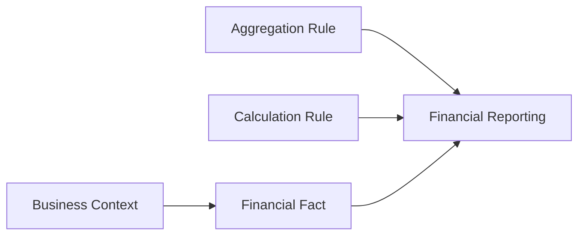

Trong khi đó, Student, EDU và HR tập trung trước vào việc tổ chức dữ liệu nghiệp vụ.

Điều này tạo ra một sự phân tầng tự nhiên:

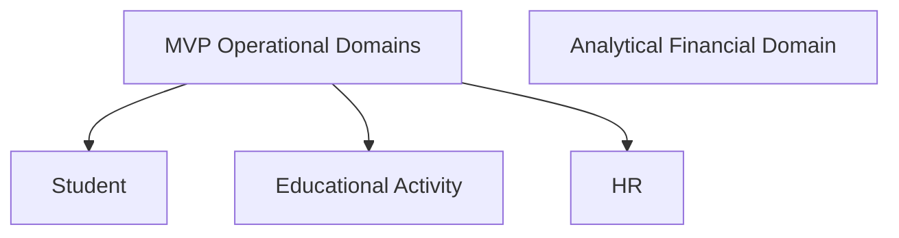

Trong tương lai, nếu cần xây dựng Data Warehouse cho Student, EDU và HR, các domain operational này có thể trở thành nguồn dữ liệu cho analytical layer.

Nhưng đó không phải scope của MVP hiện tại.

---

# 15. Kết luận

Bài toán hiện tại không phải là xây dựng một Enterprise Platform hoàn chỉnh.

Bài toán là tổ chức dữ liệu đúng ngay từ đầu để các domain có thể phát triển độc lập.

Kiến trúc MVP được chia thành bốn cụm rõ ràng:

1. **Student Management**
2. **EDU — Educational Activity Management**
3. **HR Management**
4. **Financial Data Warehouse hiện hữu**

Các cụm được liên kết bởi một số thực thể dùng chung tối thiểu:

* Person.
* Organization.
* Calendar/Time.

Quan hệ giữa các domain được xác định rõ:

```text
Person
 ├── Student
 └── Employee

Student
 └── Enrollment
       └── Class

Class
 └── Educational Activity

Student
 └── Participation
       ├── Attendance
       └── Assessment / Result

Employee
 └── Activity Responsibility

Financial
 └── Independent Financial Data Domain
```

Triết lý của kiến trúc là:

> **Build the MVP by domain, preserve clear ownership, and create only the relationships that the business needs today.**

Như vậy, MVP có thể được xây dựng nhanh.

Nhưng quan trọng hơn, khi Student, EDU và HR phát triển, hệ thống vẫn có một kiến trúc đủ rõ ràng để mở rộng mà không phải phá vỡ các domain đã xây dựng trước đó.
